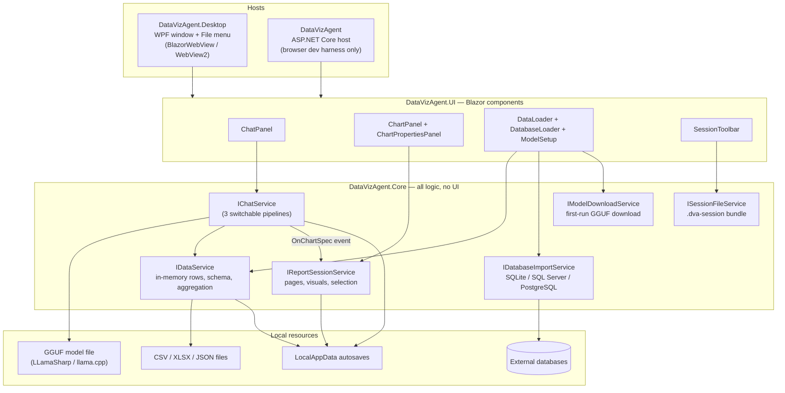
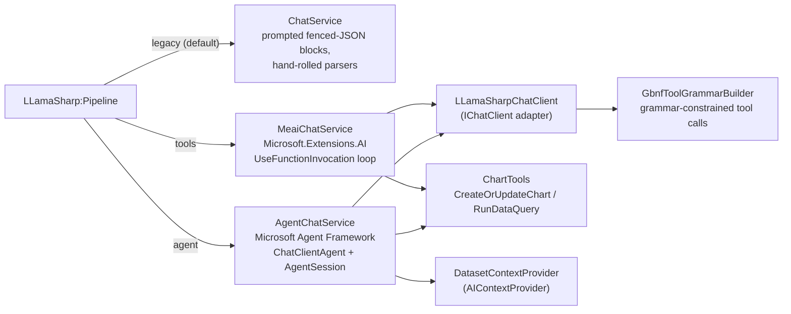
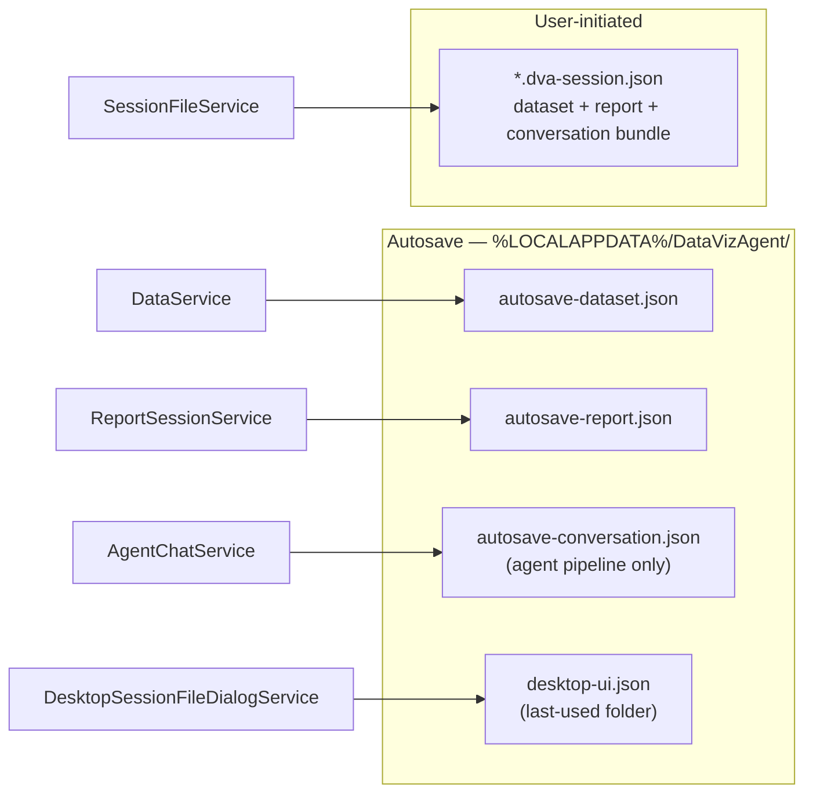

# DataViz Agent — Architecture

A local-first, agentic data-visualization **desktop app**: a WPF shell hosting a Blazor UI,
driven by a GGUF language model running fully on-device via LLamaSharp (llama.cpp).
No cloud, no API keys.

This document describes the system as it exists today. For build/run instructions see the
[README](../README.md).

---

## 1. System overview



**Projects**

| Project | Role |
|---|---|
| `DataVizAgent.Core` | Domain models, data engine, agent pipelines, persistence. No UI references. |
| `DataVizAgent.UI` | Razor class library — all Blazor components, CSS, and the one JS file. Shared by both hosts. |
| `DataVizAgent.Desktop` | WPF + BlazorWebView shell. **This is the product.** Native menu, native file dialogs, DI bootstrap. |
| `DataVizAgent` | Minimal ASP.NET Core host serving the same UI in a browser. Development convenience only. |
| `tests/DataVizAgent.Core.Tests` | xUnit tests against Core (no UI, no network, no model required). |

All services are registered in
[`ServiceCollectionExtensions.AddDataVizAgentCore`](../src/DataVizAgent.Core/Extensions/ServiceCollectionExtensions.cs)
as singletons; components receive them via constructor/`@inject` DI. Cross-service
communication uses .NET events (`OnChartSpec`, `Changed`, `HistoryCleared`,
`CommandRequested`) so publishers never reference subscribers.

---

## 2. The chart request flow

What happens when the user types "show sales by region":

```mermaid
sequenceDiagram
    participant U as ChatPanel (UI)
    participant C as IChatService
    participant M as GGUF model (LLamaSharp)
    participant V as ChartSpecValidator
    participant D as IDataService
    participant R as ReportSessionService

    U->>C: SendAsync("show sales by region")
    C->>D: GetDataSummary() + GetColumnProfile()
    C->>M: prompt = system + schema + history + user turn
    M-->>C: streamed tokens (prose + tool call)
    Note over C: prose streamed to UI as snapshots;<br/>reasoning + tool JSON withheld
    C->>V: Validate(chart request) against live schema
    V->>D: QuerySeriesWithStats(x, y, aggregation, filters)
    D-->>V: labels + values + ignored-value count
    C-->>R: OnChartSpec event (ChartSpecResult)
    R->>R: add/update visual, autosave report
    R-->>U: Changed event → report panel re-renders
    C-->>U: final authoritative text snapshot
```

Key invariants:

- **Dataset context is re-derived every turn** (schema, column profiles, selected chart) —
  never "remembered" by the model, so it cannot go stale.
- **One validation path** — [`ChartSpecValidator`](../src/DataVizAgent.Core/Services/ChartSpecValidator.cs)
  serves both the agent and the manual Properties panel.
- **Transparency** — non-numeric cells skipped during aggregation are counted
  (`ChartSpec.IgnoredValueCount`) and surfaced on the chart and to the agent.
- **Streaming is snapshot-based** — each yielded string replaces the previous one; the final
  yield is authoritative with tool-call blocks and chain-of-thought stripped
  ([`ReasoningFilter`](../src/DataVizAgent.Core/Services/ReasoningFilter.cs) handles both
  `<think>…</think>` and gpt-oss channel markers).

---

## 3. The three agent pipelines

Selected by `LLamaSharp:Pipeline` in `appsettings.json`. All implement the same
[`IChatService`](../src/DataVizAgent.Core/Services/IChatService.cs), so the UI is unaware
of which is active.



| | `legacy` | `tools` | `agent` |
|---|---|---|---|
| Tool protocol | fenced ```` ```chart ````/```` ```query ```` JSON scraped by [`ChartSpecParser`](../src/DataVizAgent.Core/Services/ChartSpecParser.cs)/[`DataQueryParser`](../src/DataVizAgent.Core/Services/DataQueryParser.cs) | typed [`AIFunction`s](../src/DataVizAgent.Core/Ai/ChartTools.cs), framework-run loop | same as `tools` |
| Tool-call robustness | prompt-only | prompt + optional **GBNF grammar** (`LLamaSharp:ConstrainToolCalls`, default on) — malformed calls are unsamplable | same as `tools` |
| Conversation memory | in-memory list, char-budget trimming | in-memory list | serializable `AgentSession`; autosaved every turn; saved into `.dva-session` files ([`IConversationStatePersistence`](../src/DataVizAgent.Core/Services/IConversationStatePersistence.cs)) |
| Multi-hop tool use | one query round-trip, hand-coded | native (framework loop) | native |

The [`LLamaSharpChatClient`](../src/DataVizAgent.Core/Ai/LLamaSharpChatClient.cs) adapter is
the provider seam: it exposes the local model behind Microsoft's standard `IChatClient`,
so the `tools`/`agent` pipelines could target Ollama, Foundry Local, or a cloud model by
swapping this single class. Because small local models are unreliable at native tool-call
tokens, it uses *prompted* tool calling (tool schemas described in the system prompt, the
model asked to emit a ` ```tool_call ` block), hardened by
[`GbnfToolGrammarBuilder`](../src/DataVizAgent.Core/Ai/GbnfToolGrammarBuilder.cs): the
tools' JSON schemas are compiled to a llama.cpp GBNF grammar so that once the model opens a
tool-call block, only schema-valid JSON can be sampled. Tools with nested/array parameters
fall back to prompted-only automatically.

---

## 4. Data engine

[`DataService`](../src/DataVizAgent.Core/Services/DataService.cs) holds the dataset
in memory as `List<Dictionary<string, object?>>` (one dictionary per row).

- **Ingest**: CSV (CsvHelper), JSON/NDJSON (`System.Text.Json`), XLSX (read as the ZIP+XML
  it really is — including detection of XLSX files masquerading as `.csv` via the `PK`
  magic bytes, and CSV-inside-a-single-column sheets).
- **Type inference**: samples 20 rows/column; a column is `Number` when ≥ 50 % of non-empty
  samples parse (tolerating `$1,299.99`, `-$5`, `15%`); `Date` when all samples parse as dates.
- **Aggregation** (`QuerySeriesWithStats`): filter → group by X → aggregate Y
  (Sum/Average/Count/Min/Max). Non-numeric cells are **skipped, not coerced to 0**, and the
  skip count is reported (Power BI-style transparency; blanks are silently ignored like DAX).
- **Database import**: one ADO.NET code path over three providers, guarded by
  [`ReadOnlyQueryGuard`](../src/DataVizAgent.Core/Services/ReadOnlyQueryGuard.cs)
  (single `SELECT`/`WITH…SELECT`; literal/comment-aware `;` detection) plus read-only
  connection modes where the provider supports them (SQLite `Mode=ReadOnly`, PostgreSQL
  `default_transaction_read_only=on`).

> **Known scale ceiling**: the dictionary-per-row store and full-scan LINQ aggregation are
> comfortable to ~10⁵ rows. The planned upgrade path is an embedded analytical store
> (e.g. DuckDB) behind the same `IDataService` seam.

---

## 5. Persistence map



- Autosaves restore on launch (dataset + report always; conversation on the `agent` pipeline,
  including the visible chat log via
  [`IConversationDisplayHistory`](../src/DataVizAgent.Core/Services/IConversationDisplayHistory.cs)).
- Autosave writers are best-effort (never crash the app), run off the caller's thread for the
  dataset, and use latest-wins version counters.
- `Persisted*` DTO classes decouple the on-disk JSON shape from the domain models.
- "New Session" clears all three autosaves.

**Model resolution & first-run download**: on startup the model path resolves as
config value (file *or* folder) → `LLAMASHARP_MODEL_PATH` env var → first `*.gguf` in
`models/` next to the exe. If nothing is found, the UI shows
[`ModelSetup`](../src/DataVizAgent.UI/Components/Data/ModelSetup.razor) offering a curated,
tier-labelled catalog ([`ModelCatalog`](../src/DataVizAgent.Core/Services/ModelCatalog.cs)) —
each entry pinned to an immutable Hugging Face revision with expected size and SHA-256.
[`ModelDownloadService`](../src/DataVizAgent.Core/Services/ModelDownloadService.cs) streams
with HTTP-Range resume, verifies the hash, and installs atomically (`.part` → rename);
a failed download can never leave a loadable half-file.

---

## 6. Hosts and UI notes

- **Desktop**: `MainWindow.xaml` mounts the Blazor **`Routes`** component (not `Home`
  directly) so desktop and web render the identical tree — router → `MainLayout`
  (full-height shell) → `Home`. The WPF File menu drives the Blazor UI through
  [`ISessionCommandBus`](../src/DataVizAgent.Core/Services/ISessionCommandBus.cs); native
  open/save dialogs come from `DesktopSessionFileDialogService`
  ([`ISessionFileDialogService`](../src/DataVizAgent.Core/Services/ISessionFileDialogService.cs)
  is registered host-first, with the browser implementation as the `TryAdd` fallback).
- **UI conventions**: components subscribe to service `Changed` events in `OnInitialized`
  and unsubscribe in `Dispose`; design tokens live in
  [`app.css`](../src/DataVizAgent.UI/wwwroot/app.css) `:root`; the only JavaScript is
  [`session-file.js`](../src/DataVizAgent.UI/wwwroot/session-file.js) (file download,
  confirm dialog, print).
- **Charts** render via the Blazor-ApexCharts wrapper in
  [`ChartRenderer`](../src/DataVizAgent.UI/Components/Charts/ChartRenderer.razor).
- **Printing** adds a CSS class + `window.print()`; print styles show only the active
  page's charts.

---

## 7. Configuration reference (agent-relevant)

| Key | Default | Effect |
|---|---|---|
| `LLamaSharp:Pipeline` | `legacy` | Selects the chat pipeline (see §3). |
| `LLamaSharp:ConstrainToolCalls` | `true` | GBNF grammar on tool calls (`tools`/`agent`). |
| `LLamaSharp:ModelPath` | `models/` | GGUF file **or** folder containing one. |
| `LLamaSharp:Backend` | `cpu` | `cuda` requires a build with `-p:EnableCuda=true`; falls back to CPU. |
| `LLamaSharp:ContextSize` | `4096` | Model context window; history trimming budgets against it. |
| `LLamaSharp:ResponseStartMarker` | — | Optional explicit "answer starts here" marker; `<think>` handling is automatic. |

---

## 8. Design decisions (short rationale)

1. **Interfaces + DI everywhere** — three chat pipelines, two hosts, and disk-free tests all
   hang off the same seams.
2. **Events for cross-module signaling** — chat never references the report; the WPF menu
   never references Blazor components.
3. **Prompted tool calls + grammar, not native tool tokens** — small local GGUF models are
   uneven at native tool calling; the grammar makes malformed calls impossible instead of
   merely unlikely.
4. **State re-derived, not remembered** — schema/report context is rebuilt per turn;
   conversation history is the only true memory (bounded window; no summarization by design).
5. **Never silently drop data** — skipped non-numeric values are counted and shown
   (chart caption + agent note).
6. **DTOs at the serialization edge** — session/autosave formats can stay stable while
   domain models evolve.
7. **CPU-only by default** — the CUDA backend (~1 GB native libs) is an opt-in build flavor,
   with runtime auto-fallback if configured but absent.
